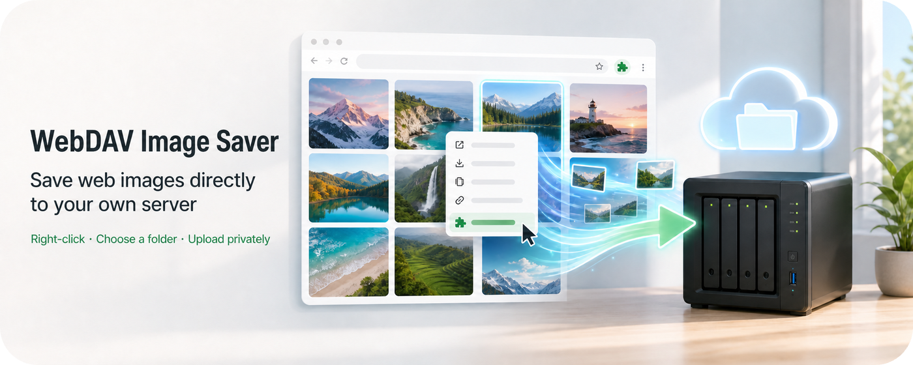
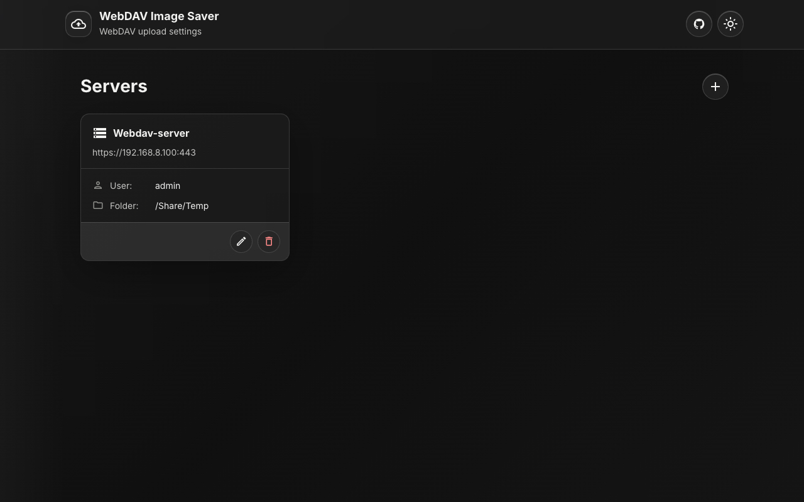
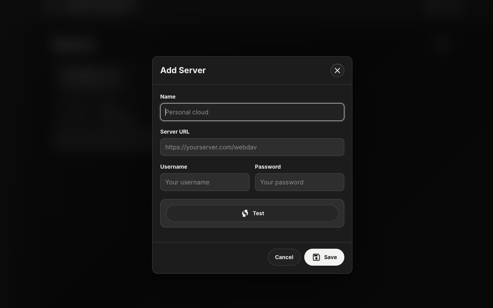
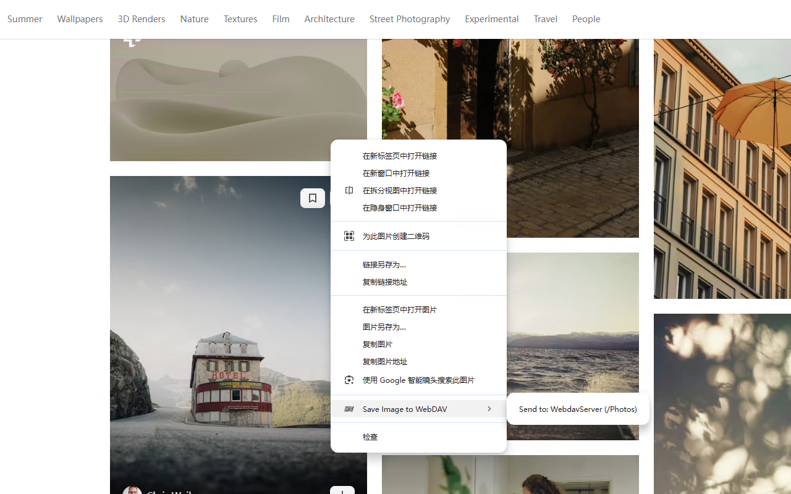

<p align="center">
  
</p>
<h1 align="center">WebDAV Image Saver</h1>
<p align="center">
  <a href="https://github.com/mrjoechen/webdav-image-saver/releases/latest"></a>
  <a href="https://github.com/mrjoechen/webdav-image-saver/stargazers"></a>
  <a href="https://ko-fi.com/joechen"></a>
</p>
<p align="center">
  <b>English</b> | <a href="README.zh-CN.md">中文</a>
</p>

<p align="center">
   
</p>

## Overview

Save web images directly to your own WebDAV server from Chrome's right-click menu.

WebDAV Image Saver is a Manifest V3 Chrome extension for people who keep images in Nextcloud, ownCloud, Synology, QNAP, or any other WebDAV-compatible storage. It does not use any developer-operated server or hosted backend, and it does not collect, store, or transmit your images, credentials, browsing data, or settings to the developer. Configuration, image fetching, folder browsing, and uploads happen inside your browser, with extension data stored locally in Chrome's extension storage.

<a href="https://chromewebstore.google.com/detail/webdav-image-saver/ejgeeldiamekhajplkinnilgdkfcjdep">
  
</a>

## Screenshots

<table>
  <tr>
    <td width="33%" align="center">
      
      <br><sub>Manage configured WebDAV</sub>
    </td>
    <td width="33%" align="center">
      
      <br><sub>Add and test a WebDAV server</sub>
    </td>
  </tr>
  <tr>
    <td width="33%" align="center">
      
      <br><sub>Choose a destination from the image context menu</sub>
    </td>
  </tr>
</table>

## Install from the Chrome Web Store

WebDAV Image Saver is available on the official Chrome Web Store:

**[Install WebDAV Image Saver](https://chromewebstore.google.com/detail/webdav-image-saver/ejgeeldiamekhajplkinnilgdkfcjdep)**

After installation, click the extension icon to configure your WebDAV server. You can pin the extension from Chrome's Extensions menu for quicker access.

## Install from GitHub Releases

You can also install a packaged version from the **[GitHub Releases page](https://github.com/mrjoechen/webdav-image-saver/releases)**:

1. Open the latest release and download `webdav-image-saver-v*.zip` from **Assets**.
2. Open `chrome://extensions` in Chrome.
3. Enable **Developer mode** in the upper-right corner.
4. Drag the downloaded ZIP file onto the extensions page to install it.
5. If your browser does not accept ZIP drag-and-drop, extract the ZIP file to a permanent folder, click **Load unpacked**, and select the extracted folder containing `manifest.json`.
6. Click the extension icon to configure your WebDAV server.

Extensions installed from GitHub Releases do not update automatically through the Chrome Web Store. To upgrade, download the ZIP from the newest release and reinstall it. If you installed from an extracted folder, replace the extracted files and click **Reload** for WebDAV Image Saver on `chrome://extensions`.

For automatic updates, install the extension from the Chrome Web Store instead.

## Features

- Save any right-clicked web image to a configured WebDAV destination.
- Configure multiple WebDAV servers.
- Test WebDAV connectivity before saving.
- Browse multi-level WebDAV folders and choose a target folder.
- Save original images, ask for a format each time, or convert static images to PNG, JPG, or WebP.
- Choose automatic naming, preserve the original filename, or define a reusable filename template.
- Keep each server's configured target folder fixed, or organize uploads automatically by date, website, or both.
- Review live filename and directory previews before saving global rules.
- Use the tabbed Save settings dialog to manage image format, filename, and directory preferences.
- Switch the settings page between English and Chinese.
- Preserve animated and unsupported images in their original format with a visible warning.
- Show a short countdown bubble before upload, with a cancel action.
- Open the settings page from the extension toolbar icon.
- Light/dark monochrome settings UI with packaged SVG icons.

## Install for Development

1. Open `chrome://extensions`.
2. Enable **Developer mode**.
3. Click **Load unpacked**.
4. Select this repository folder.
5. Click the extension icon to open settings.

## Configure a WebDAV Server

1. Open the settings page.
2. Click **Add**.
3. Enter:
   - `Name`
   - `Server URL`, for example `https://example.com/remote.php/dav/files/username`
   - `Username`
   - `Password`
4. Click **Test**.
5. If the connection succeeds, choose a folder in the folder picker.
6. Click **Save**.

Use HTTPS WebDAV URLs whenever possible. HTTP may work technically, but it sends Basic Auth credentials without transport encryption.

## Usage

1. Right-click an image on a web page.
2. Choose **Save Image to WebDAV**.
3. Pick the configured server destination.
4. If **Ask every time** is enabled, choose **Original**, **PNG**, **JPG**, or **WebP** in the page prompt.
5. Wait for the countdown or click **Cancel**.

Use the settings button in the options page header to choose global preferences. The Save settings dialog is split into **Image format**, **File naming rule**, and **Save directory rule** tabs, with live previews for generated filenames and resolved upload paths. PNG conversion is lossless. JPG and WebP use quality `0.92`; transparent areas are filled white when converting to JPG. Animated GIF, APNG, animated WebP, and images the browser cannot convert are uploaded unchanged and reported with a warning.

Use the language toggle in the settings header to switch the options page between English and Chinese. The choice is remembered locally in the browser.

All detection and conversion runs locally in the browser. No hosted conversion service is used.

### File naming rules

The global **File naming rule** setting offers three modes:

- **Automatic** (default): keeps the extension's existing automatic naming behavior, for example `image_20260820153045_www_example_com.jpg`.
- **Original filename**: reuses the source image's filename without its old extension.
- **Custom template**: builds the filename from a template such as:

```text
{originalName}_{date}_{domain}.{ext}
```

Custom templates support `{originalName}`, `{date}` (`YYYYMMDD`), `{time}` (`HHMMSS`), `{domain}`, `{pageTitle}`, `{width}`, `{height}`, and `{ext}`. The `{domain}` value removes a leading `www.` while preserving other subdomains.

The settings page shows a live filename preview for every naming mode. When using a custom template, click the variable buttons to insert placeholders at the cursor. Invalid templates are reported inline, including empty templates, unbalanced braces, empty variables, nested variables, and unsupported variables.

The final extension always matches the image format that is actually uploaded, even if the source filename or template specifies something else. Characters unsupported by WebDAV filesystems are cleaned automatically before upload.

### Save directory rules

The global **Save directory rule** is applied relative to each selected server's own configured target folder. For example, if that server's target is `/Images`, the available modes are:

- **Fixed directory**: `/Images` (the configured target itself).
- **By date**: `/Images/2026/08`.
- **By website**: `/Images/example.com`.
- **By website and date**: `/Images/example.com/2026/08`.

`/Images` is only an example of a user-configured server target; it is not a hardcoded directory. Website folders remove a leading `www.` from the page domain. For every non-fixed rule, missing dynamic subfolders are created automatically before the image is uploaded.

The settings page shows a path preview as you change the save-directory rule, so you can confirm the folder structure before saving.

## Permissions

The extension requests these permissions:

- `contextMenus`: Adds the right-click save menu for images.
- `storage`: Stores WebDAV server configurations in Chrome extension storage.
- `scripting`: Injects the countdown/status bubble into the current page after you choose a save action.
- `host_permissions: <all_urls>`: Fetches the selected image URL and connects to user-provided WebDAV URLs.

## Data Handling

- The extension has no developer-operated server or hosted backend.
- WebDAV configuration is stored locally in `chrome.storage.local`.
- Images are fetched and uploaded directly by the browser to the WebDAV server you configure.
- Your images, credentials, browsing data, and settings are not collected, saved, or transmitted to the developer.
- No analytics, tracking, hosted API, or developer-operated server is used.
- Credentials are not app-level encrypted by this extension. They rely on Chrome profile and operating-system storage protections.

See [PRIVACY.md](PRIVACY.md) for the full privacy policy.

## Development Checks

Run syntax checks before packaging:

```bash
node --test
node --check image-format.js
node --check filename-rule.js
node --check directory-rule.js
node --check settings.js
node --check background.js
node --check content_script.js
node --check options/options.js
```

Check for remote resources before Chrome Web Store submission:

```bash
rg "https://|http://|fonts.googleapis|gstatic|eval\\(|new Function" manifest.json image-format.js filename-rule.js directory-rule.js settings.js background.js content_script.js options assets
```

The options page should use only packaged files and inline SVG symbols. Do not add remotely hosted scripts, styles, fonts, or icon fonts.

## Chrome Web Store Packaging

Recommended package contents:

```text
manifest.json
image-format.js
filename-rule.js
directory-rule.js
settings.js
background.js
content_script.js
assets/
icons/
options/
PRIVACY.md
STORE_DESCRIPTION.md
```

Do not include repository-only files in the upload ZIP, such as `.git`, `docs/`, development notes, screenshots-in-progress, or OS metadata.

Manual packaging example (run from anywhere inside the repository). It resolves the repository root, uses fresh task-specific temporary directories for both staging and the archive, and places `manifest.json` at the ZIP root:

```bash
set -eu

package_repo_root="$(git rev-parse --show-toplevel)"
package_staging="$(mktemp -d "${TMPDIR:-/tmp}/webdav-image-saver-staging.XXXXXX")"
package_archive_dir="$(mktemp -d "${TMPDIR:-/tmp}/webdav-image-saver-archive.XXXXXX")"
package_archive="$package_archive_dir/webdav-image-saver.zip"

cp \
  "$package_repo_root/manifest.json" \
  "$package_repo_root/image-format.js" \
  "$package_repo_root/filename-rule.js" \
  "$package_repo_root/directory-rule.js" \
  "$package_repo_root/settings.js" \
  "$package_repo_root/background.js" \
  "$package_repo_root/content_script.js" \
  "$package_repo_root/PRIVACY.md" \
  "$package_repo_root/STORE_DESCRIPTION.md" \
  "$package_staging/"
cp -R \
  "$package_repo_root/assets" \
  "$package_repo_root/icons" \
  "$package_repo_root/options" \
  "$package_staging/"

(
  cd "$package_staging"
  zip -X -r "$package_archive" . \
    -x '*.DS_Store' \
    -x '__MACOSX/*' \
    -x '*/__MACOSX/*'
)

mkdir -p "$package_repo_root/dist"
mv "$package_archive" "$package_repo_root/dist/webdav-image-saver.zip"
rmdir "$package_archive_dir"
rm -rf "$package_staging"
```

Before upload, verify:

- Manifest version and description are final.
- Icons are exactly 16x16, 48x48, and 128x128.
- The ZIP contains only runtime files.
- The privacy policy URL is public and matches actual behavior.
- Store listing claims match implemented features.

## License

Add a license before publishing if this repository is intended to be open source.
