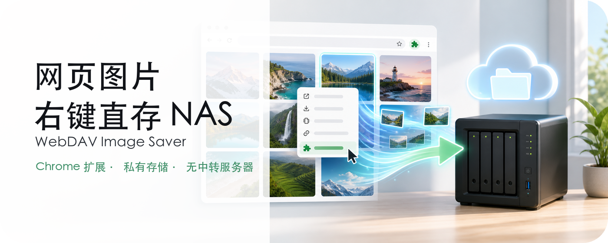

<p align="center">
  
</p>
<h1 align="center">WebDAV Image Saver</h1>
<p align="center">
  <a href="https://github.com/mrjoechen/webdav-image-saver/releases/latest"></a>
  <a href="https://github.com/mrjoechen/webdav-image-saver/stargazers"></a>
  <a href="https://ko-fi.com/joechen"></a>
</p>
<p align="center">
   <a href="README.md">English</a> ｜ <b>中文</b>
</p>


<p align="center">
   
</p>

## Overview

通过 Chrome 右键菜单，将网页图片直接保存到你自己的 WebDAV 服务器。

WebDAV Image Saver 是一个 Manifest V3 Chrome 扩展，适合将图片保存到 Nextcloud、ownCloud、Synology、QNAP 或其他 WebDAV 兼容存储的用户。它没有任何开发者运营的服务器或托管后端，不会收集、保存或向开发者传输你的图片、凭据、浏览数据或设置。配置、图片获取、目录浏览和上传都在浏览器内完成，扩展数据保存在 Chrome 本地扩展存储中。

<a href="https://chromewebstore.google.com/detail/webdav-image-saver/ejgeeldiamekhajplkinnilgdkfcjdep">
  
</a>

## 界面截图

<table>
  <tr>
    <td width="33%" align="center">
      
      <br><sub>管理已配置的 WebDAV 服务器</sub>
    </td>
    <td width="33%" align="center">
      
      <br><sub>添加并测试 WebDAV 服务器</sub>
    </td>
  </tr>
  <tr>
    <td width="33%" align="center">
      
      <br><sub>从图片右键菜单选择目标位置</sub>
    </td>
  </tr>
</table>

## 从 Chrome Web Store 安装

WebDAV Image Saver 已上架官方 Chrome Web Store：

**[安装 WebDAV Image Saver](https://chromewebstore.google.com/detail/webdav-image-saver/ejgeeldiamekhajplkinnilgdkfcjdep)**

安装后，点击扩展图标配置你的 WebDAV 服务器。你也可以在 Chrome 的扩展程序菜单中固定该扩展，方便快速使用。

## 从 GitHub Releases 安装

你也可以从 **[GitHub Releases 页面](https://github.com/mrjoechen/webdav-image-saver/releases)** 安装打包版本：

1. 打开最新 release，并从 **Assets** 下载 `webdav-image-saver-v*.zip`。
2. 在 Chrome 中打开 `chrome://extensions`。
3. 打开右上角的 **开发者模式**。
4. 将下载的 ZIP 文件直接拖到扩展程序页面进行安装。
5. 如果当前浏览器不支持拖拽 ZIP 安装，也可以将 ZIP 解压到一个固定目录，点击 **加载已解压的扩展程序**，选择包含 `manifest.json` 的解压目录。
6. 点击扩展图标配置你的 WebDAV 服务器。

通过 GitHub Releases 安装的扩展不会通过 Chrome Web Store 自动更新。升级时，请从最新 release 下载 ZIP 并重新安装；如果你使用的是解压目录安装，请替换已解压文件，然后在 `chrome://extensions` 中点击 WebDAV Image Saver 的 **重新加载**。

如需自动更新，请改用 Chrome Web Store 安装。

## 功能

- 将任意右键点击的网页图片保存到已配置的 WebDAV 目标位置。
- 支持配置多个 WebDAV 服务器。
- 保存前可测试 WebDAV 连接。
- 支持浏览多级 WebDAV 目录并选择目标文件夹。
- 上传前显示短暂倒计时气泡，并支持取消。
- 可从扩展工具栏图标打开设置页面。
- 使用随包提供的 SVG 图标，设置界面支持浅色/深色单色主题。

## 开发安装

1. 打开 `chrome://extensions`。
2. 启用 **开发者模式**。
3. 点击 **加载已解压的扩展程序**。
4. 选择本仓库目录。
5. 点击扩展图标打开设置页面。

## 配置 WebDAV 服务器

1. 打开设置页面。
2. 点击 **Add**。
3. 输入：
   - `Name`
   - `Server URL`，例如 `https://example.com/remote.php/dav/files/username`
   - `Username`
   - `Password`
4. 点击 **Test**。
5. 如果连接成功，在目录选择器中选择目标文件夹。
6. 点击 **Save**。

请尽量使用 HTTPS WebDAV URL。HTTP 在技术上可能可用，但会在没有传输加密的情况下发送 Basic Auth 凭据。

## 使用方式

1. 在网页图片上点击右键。
2. 选择 **Save Image to WebDAV**。
3. 选择已配置的服务器目标位置。
4. 等待倒计时结束，或点击 **Cancel** 取消。

扩展会生成类似下面的文件名：

```text
image_YYYYMMDDHHMMSS_example_com.jpg
```

## 权限

扩展会请求以下权限：

- `contextMenus`：为图片添加右键保存菜单。
- `storage`：将 WebDAV 服务器配置保存到 Chrome 扩展存储中。
- `scripting`：在你选择保存操作后，将倒计时/状态气泡注入当前页面。
- `host_permissions: <all_urls>`：获取所选图片 URL，并连接用户提供的 WebDAV URL。

## 数据处理

- 扩展没有任何开发者运营的服务器或托管后端。
- WebDAV 配置本地存储在 `chrome.storage.local`。
- 图片由浏览器直接获取，并上传到你配置的 WebDAV 服务器。
- 你的图片、凭据、浏览数据和设置不会被收集、保存或传输给开发者。
- 不使用分析、跟踪、托管 API 或开发者运营的服务器。
- 本扩展不会在应用层加密凭据。凭据依赖 Chrome 用户资料和操作系统存储保护。

完整隐私政策见 [PRIVACY.md](PRIVACY.md)。

## 开发检查

打包前运行语法检查：

```bash
node --check background.js
node --check content_script.js
node --check options/options.js
```

提交 Chrome Web Store 前检查远程资源：

```bash
rg "https://|http://|fonts.googleapis|gstatic|eval\\(|new Function" manifest.json background.js content_script.js options assets
```

设置页面应只使用随包提供的文件和内联 SVG symbols。不要添加远程托管的脚本、样式、字体或图标字体。

## Chrome Web Store 打包

推荐打包内容：

```text
manifest.json
background.js
content_script.js
assets/
icons/
options/
PRIVACY.md
STORE_DESCRIPTION.md
```

上传 ZIP 中不要包含仅供仓库使用的文件，例如 `.git`、`docs/`、开发笔记、未完成截图或系统元数据。

手动打包示例：

```bash
mkdir -p dist/webdav-image-saver
cp manifest.json background.js content_script.js PRIVACY.md STORE_DESCRIPTION.md dist/webdav-image-saver/
cp -R assets icons options dist/webdav-image-saver/
cd dist
zip -X -r webdav-image-saver.zip webdav-image-saver
```

上传前请确认：

- Manifest 版本和描述已经最终确认。
- 图标尺寸准确为 16x16、48x48 和 128x128。
- ZIP 只包含运行时文件。
- 隐私政策 URL 可公开访问，并与实际行为一致。
- 商店详情页中的声明与已实现功能一致。


## 许可证

如果该仓库计划作为开源项目发布，请在发布前添加许可证。
